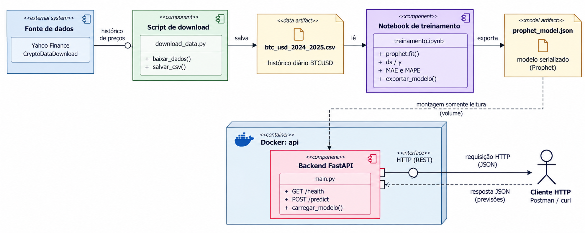
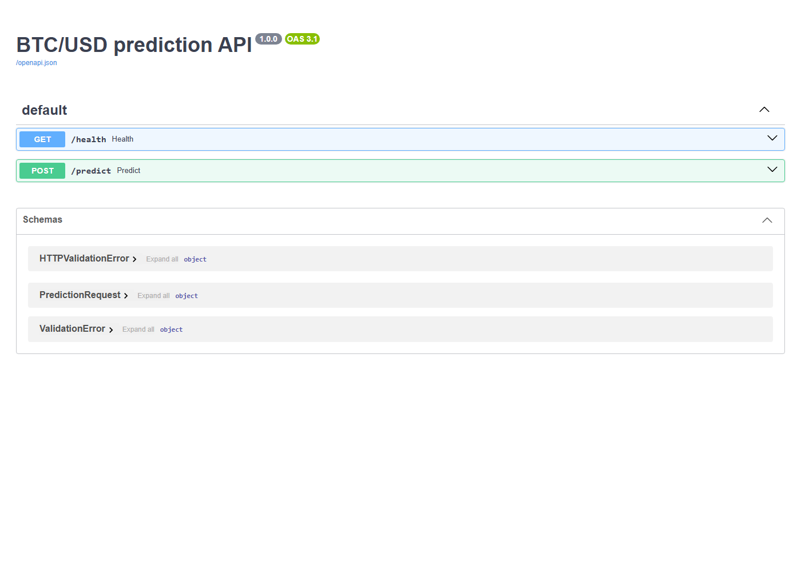
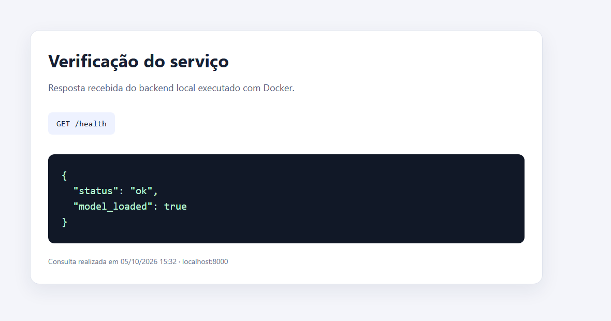
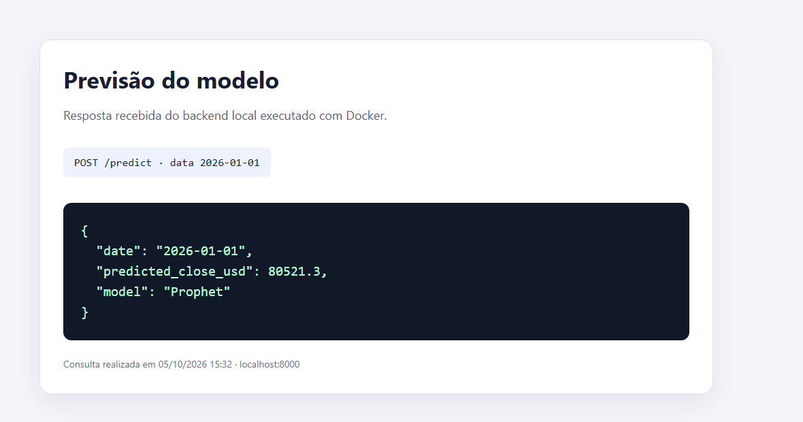

# Atividade Ponderada M7: previsão de BTC/USDT com Prophet

&emsp;Este projeto acompanha o caminho de uma previsão desde a coleta dos preços até a resposta de uma API. Primeiro, organizo o histórico diário do Bitcoin. Depois, treino e avalio o Prophet em um notebook, salvo o modelo e disponibilizo esse arquivo para um serviço Python executado com Docker. O objetivo é demonstrar essa integração de forma simples, não criar uma ferramenta para decidir investimentos.

## Diagrama UML



&emsp;O diagrama resume como os dados chegam ao notebook, como o modelo treinado é salvo e como a API recebe esse arquivo. O notebook gera `artifacts/prophet_model.json`. Quando a API inicia, o Docker disponibiliza esse artefato em modo somente leitura.

&emsp;Na apresentação, vale explicar uma diferença visível no desenho: a legenda mostra BTCUSD, mas os dados usados são do par BTCUSDT da Binance. O Yahoo Finance limitou as requisições durante a coleta, então usei o arquivo da Binance como alternativa. USDT acompanha o dólar, mas não representa exatamente a mesma cotação de BTC para USD.

## Objetivo e escopo

&emsp;O objetivo é mostrar as etapas de uma solução de aprendizado de máquina: obter uma série histórica, treinar e avaliar um modelo, salvar o resultado e disponibilizá-lo por um backend Python. A previsão é apenas didática e não deve ser usada como recomendação de investimento.

&emsp;O treinamento está no notebook [`notebook/treinamento_prophet.ipynb`](notebook/treinamento_prophet.ipynb). O Docker Compose mantém somente a API como serviço. O artefato treinado está em `artifacts/`, então é possível testar a API sem treinar o modelo novamente. Também há uma imagem Docker que executa o notebook uma vez e grava os resultados nas pastas locais. Esse container de treinamento termina ao concluir o trabalho e não fica rodando junto com a API.

## Dados

&emsp;O arquivo [`data/btc_usd_2024_2025.csv`](data/btc_usd_2024_2025.csv) tem 731 observações diárias, de 1º de janeiro de 2024 a 31 de dezembro de 2025. Ele contém data, abertura, máxima, mínima, fechamento e volume.

&emsp;&emsp;O script [`data/download_data.py`](data/download_data.py) tenta obter BTC para USD do [Yahoo Finance](https://finance.yahoo.com/quote/BTC-USD/history/) usando `yfinance`. Na coleta registrada para este projeto, o Yahoo Finance limitou temporariamente as requisições. Por isso, o script usou o histórico diário de BTCUSDT da Binance, disponível no [CryptoDataDownload](https://www.cryptodatadownload.com/cdd/Binance_BTCUSDT_d.csv), uma das fontes sugeridas no enunciado. A origem efetivamente usada está anotada em [`data/data_source.json`](data/data_source.json).

&emsp;O download é feito separadamente do notebook e também está preparado para rodar em Docker. Na raiz do repositório, com o Docker Desktop aberto, execute:

```powershell
docker build -f Dockerfile.download -t atividade-m7-download .
$repo = (Get-Location).Path
docker run --rm `
  -v "${repo}\data:/app/data" `
  atividade-m7-download
```

&emsp;O container grava o CSV e o arquivo com a origem dos dados na pasta `data/` do projeto. Como o CSV já está versionado, não é preciso baixá-lo novamente para executar o notebook. Uma nova coleta depende de conexão com a internet e da disponibilidade das fontes.

## Por que Prophet

&emsp;Escolhi o Prophet, biblioteca criada pelo time do Facebook, hoje Meta, porque foi uma sugestão do professor e foi feita para trabalhar com séries temporais. O modelo recebe uma coluna de datas chamada `ds` e uma coluna com o valor a prever chamada `y`. No notebook, `Date` passa a se chamar `ds`, e `Close` passa a se chamar `y`. Segui o [guia inicial oficial do Prophet](https://facebook.github.io/prophet/docs/quick_start.html).

&emsp;Preferi não acrescentar modelos mais complexos porque a prioridade da atividade é mostrar a ligação entre os dados, o treinamento, o arquivo do modelo e a API. Para avaliar o Prophet, o notebook avança um dia por vez e usa somente as informações disponíveis até aquela data. Também compara o resultado com uma referência simples, que prevê o próximo fechamento repetindo o valor do dia anterior.

## Como treinar

&emsp;Para abrir o notebook em Jupyter localmente:

```powershell
py -m pip install -r requirements-notebook.txt
py -m jupyter lab
```

&emsp;Também é possível executar o notebook dentro de um container temporário. Na raiz do repositório, abra o PowerShell e rode:

```powershell
docker build -f Dockerfile.notebook -t atividade-m7-prophet-notebook .
$repo = (Get-Location).Path
docker run --rm `
  -v "${repo}\data:/workspace/data" `
  -v "${repo}\artifacts:/workspace/artifacts" `
  -v "${repo}\notebook:/workspace/notebook" `
  atividade-m7-prophet-notebook
```

&emsp;Esse comando executa as células do notebook em ordem e salva o notebook com as saídas, o modelo e os metadados nas pastas do projeto.

&emsp;O notebook usa os primeiros 80% dos registros para treino e os 20% finais para teste, mantendo a ordem das datas. Depois da avaliação, treina o modelo final com todo o histórico. O arquivo `artifacts/prophet_model.json` contém o modelo treinado. Já `artifacts/training_metadata.json` registra a fonte, o período, a quantidade de registros e as métricas.

&emsp;O notebook registra as etapas do treinamento e mostra as métricas nas saídas das células. Assim, é possível acompanhar o processo além de apenas receber o arquivo final.

## Como iniciar e testar a API

&emsp;Depois de gerar o arquivo do modelo pelo notebook, inicie a API:

```powershell
docker compose up --build api
```

&emsp;Em outro terminal do PowerShell, confira se o serviço está ativo:

```powershell
Invoke-RestMethod http://localhost:8000/health
```

&emsp;Depois, peça uma previsão para o dia seguinte ao fim dos dados históricos:

```powershell
Invoke-RestMethod http://localhost:8000/predict -Method Post `
  -ContentType 'application/json' `
  -Body '{"date":"2026-01-01"}'
```

&emsp;A resposta mostra a data solicitada, o fechamento previsto em dólares e o nome do modelo. Enquanto a API estiver rodando, a documentação interativa também pode ser aberta em `http://localhost:8000/docs`.

## Demonstração e resultados

### Treinamento

&emsp;O notebook foi executado em um container descartável baseado em Python 3.11 com Prophet 1.2.2. Ele gerou o artefato e registrou os resultados em `artifacts/training_metadata.json`.

```text
Fonte: CryptoDataDownload / Binance BTCUSDT
Período: 2024-01-01 a 2025-12-31
Registros: 731 (treino: 584; teste: 147)
Prophet: MAE de US$ 6.873,25 e MAPE de 6,86%
Referência do dia anterior: MAE de US$ 1.593,63 e MAPE de 1,52%
Artefato: artifacts/prophet_model.json
```

&emsp;O teste simula uma previsão de um dia à frente. Em cada data, o modelo recebe apenas os valores anteriores. Depois da previsão, o fechamento real daquele dia entra no histórico para a próxima rodada. A referência simples recebe a mesma informação. Neste teste, ela teve erro menor que o Prophet. Mantive o Prophet porque foi o modelo sugerido pelo professor e porque o foco da atividade está na integração. A previsão não deve ser usada para investir.

### API em execução

&emsp;Iniciei a API com `docker compose up --build -d api` e fiz as chamadas abaixo. Estes foram os resultados observados:

```powershell
Invoke-RestMethod http://localhost:8000/health
```

```json
{
  "status": "ok",
  "model_loaded": true
}
```

&emsp;A API retornou `status: ok` e `model_loaded: true`. Para a solicitação de 01/01/2026, respondeu:

```powershell
Invoke-RestMethod http://localhost:8000/predict -Method Post `
  -ContentType 'application/json' `
  -Body '{"date":"2026-01-01"}'
```

```json
{
  "date": "2026-01-01",
  "predicted_close_usd": 80521.3,
  "model": "Prophet"
}
```

&emsp;O resultado mostra que a API carregou o modelo exportado pelo notebook e respondeu a uma solicitação HTTP. A previsão não é uma estimativa financeira confiável.

&emsp;As imagens a seguir registram as respostas recebidas da API local durante o teste.







| Evidência | Resultado observado |
| --- | --- |
| Fonte e período do CSV | CryptoDataDownload / Binance BTCUSDT; 2024-01-01 a 2025-12-31; 731 registros |
| MAE e MAPE do Prophet | US$ 6.873,25 / 6,86% |
| MAE e MAPE da referência do dia anterior | US$ 1.593,63 / 1,52% |
| `GET /health` | `status: ok`, `model_loaded: true` |
| `POST /predict` em 2026-01-01 | US$ 80.521,30 |

## Devlog

&emsp;Este registro acompanha a ordem do trabalho, desde a leitura do enunciado até os testes. Tentei deixar visíveis as escolhas e os problemas encontrados, inclusive quando um resultado não foi o esperado.

### 1. Primeiro li o enunciado e defini o objetivo

&emsp;Comecei separando o que era obrigatório do que era opcional. O professor não estava pedindo um produto financeiro, mas uma demonstração do caminho entre dados, treinamento, arquivo do modelo, container de inferência e cliente. Por isso, escolhi uma previsão simples do fechamento diário do Bitcoin para o dia seguinte. Também anotei que deveria mostrar uma verificação de saúde da API, uma chamada de previsão e explicar as limitações.

&emsp;Para manter o projeto compatível com o tempo da atividade, decidi evitar várias camadas de serviço. O notebook seria o ambiente de treinamento, um arquivo JSON seria a passagem do modelo para a API e o Docker Compose manteria apenas o backend em execução.

### 2. Organizei o diagrama antes de detalhar o modelo

&emsp;Depois de entender o fluxo, coloquei o diagrama UML no início desta documentação, como o professor recomendou. O desenho apresenta a fonte, o script de download, o CSV, o notebook, o arquivo treinado, o container FastAPI e o cliente HTTP. A passagem do modelo foi representada pela pasta `artifacts`, que o container monta em modo somente leitura.

&emsp;Ao revisar o desenho junto dos dados reais, percebi que a legenda do CSV diz BTCUSD, enquanto a série usada é BTCUSDT da Binance. Mantive o diagrama escolhido e registrei a diferença no README para explicar durante a apresentação, em vez de apresentar os dois pares como se fossem iguais.

### 3. Preparei os dados e registrei a troca de fonte

&emsp;Escolhi preços diários entre 1º de janeiro de 2024 e 31 de dezembro de 2025 para ter pelo menos dois anos completos. O arquivo final tem 731 registros e inclui data, abertura, máxima, mínima, fechamento e volume. Comecei tentando baixar BTCUSD pelo Yahoo Finance com `yfinance`, uma das fontes sugeridas no enunciado.

&emsp;Durante a coleta, o Yahoo Finance limitou as requisições. Em vez de deixar a base vazia ou misturar fontes sem explicar, preparei o script para tentar o CSV de BTCUSDT da Binance no CryptoDataDownload como alternativa. Essa segunda fonte funcionou e foi anotada em `data/data_source.json`. Também deixei claro que USDT acompanha o dólar, mas não é idêntico à cotação BTCUSD.

&emsp;No início, o script gravava o arquivo em `/app/data`, um caminho que fazia sentido dentro de um container, mas não correspondia à execução local documentada para Windows. Corrigi o script para aceitar `DATA_DIR` e criei `Dockerfile.download`. Agora o container grava no volume `data/` do projeto. Construí essa imagem e confirmei que o script compila dentro dela. Não rodei uma nova coleta nessa verificação, para não sobrescrever o CSV já conferido.

### 4. Treinei o Prophet no notebook

&emsp;Usei o Prophet porque foi a biblioteca sugerida pelo professor e porque seu formato de entrada é direto para uma série temporal. No notebook, converti `Date` para `ds` e `Close` para `y`. O volume e as demais colunas continuam no CSV, mas não entram nesta primeira versão do modelo.

&emsp;Separei treino e teste pela ordem do tempo, sem embaralhar os registros. A avaliação principal usa os primeiros 80 por cento para formar o histórico e os últimos 20 por cento como período de teste. Para cada dia de teste, ajustei o modelo apenas com os dias anteriores, gerei uma previsão de um dia à frente e só então acrescentei o fechamento real ao histórico. Fiz a mesma comparação com uma referência simples que repete o fechamento do dia anterior.

&emsp;Encontrei um problema na primeira tentativa com Prophet 1.1.6: a instalação do CmdStan não tinha a configuração esperada para executar o modelo. Registrei esse erro no processo, atualizei a dependência para Prophet 1.2.2 e rodei o notebook novamente. A execução terminou e gerou `artifacts/prophet_model.json` e `artifacts/training_metadata.json`.

&emsp;O resultado não favoreceu o Prophet. No período de teste, ele teve MAE de US$ 6.873,25 e MAPE de 6,86 por cento. A referência do dia anterior teve MAE de US$ 1.593,63 e MAPE de 1,52 por cento. Mantive esses números no README porque esconder a comparação daria uma impressão incorreta da qualidade do modelo.

### 5. Testei ajustes sem substituir o resultado publicado

&emsp;Como queria verificar se uma configuração diferente ajudaria, fiz um experimento separado com cinco variações do Prophet. Usei 70 por cento iniciais para treino, os 10 por cento seguintes para escolher a configuração e deixei os 20 por cento finais separados para a avaliação final. Comparei a configuração atual, a retirada da sazonalidade anual, dois valores de flexibilidade da tendência e a sazonalidade multiplicativa.

&emsp;A sazonalidade multiplicativa foi a melhor na validação, com MAE de US$ 2.509,93 e MAPE de 2,27 por cento. Porém, no período final reservado, ela teve MAE de US$ 6.923,78 e MAPE de 6,88 por cento. A configuração atual teve MAE de US$ 6.873,25 e MAPE de 6,86 por cento, enquanto a referência continuou em US$ 1.593,63 e 1,52 por cento. Portanto, o ajuste não melhorou o resultado final e não substituí o artefato do projeto.

&emsp;A referência do dia anterior também foi melhor na validação, com MAE de US$ 1.207,18 e MAPE de 1,10 por cento. Isso mostra que a diferença não apareceu apenas no último período. Deixei o teste reproduzível em [`experiments/prophet_experiment.py`](experiments/prophet_experiment.py). Ele lê o CSV e imprime as métricas, sem gravar por cima do modelo treinado. A ideia foi verificar uma hipótese sem selecionar o vencedor olhando diretamente para o teste final.

&emsp;Para repetir o experimento, na raiz do repositório e com a imagem `atividade-m7-prophet-notebook` disponível, monto os dados e o script como somente leitura:

```powershell
$repo = (Get-Location).Path
docker run --rm `
  -v "${repo}\data:/workspace/data:ro" `
  -v "${repo}\experiments:/experiment:ro" `
  atividade-m7-prophet-notebook `
  python /experiment/prophet_experiment.py /workspace/data/btc_usd_2024_2025.csv
```

### 6. Preparei e executei o backend

&emsp;Depois de gerar o modelo, implementei o backend em Python com FastAPI. Na inicialização, ele lê `artifacts/prophet_model.json`. A rota `GET /health` informa se a API está ativa e se o modelo foi carregado. A rota `POST /predict` recebe uma data e devolve o fechamento previsto.

&emsp;Separei o backend em sua própria imagem Docker com `Dockerfile.api`. No `docker-compose.yml`, configurei a porta 8000 e a montagem somente leitura da pasta `artifacts`. Assim, o container usa o arquivo treinado pelo notebook, sem precisar treinar o modelo dentro do serviço de inferência. O treinamento pode ser repetido com o container temporário definido em `Dockerfile.notebook`; o serviço que fica ativo no Compose é só a API.

### 7. Fiz as chamadas e guardei as evidências

&emsp;Com o serviço ativo, consultei `/health` e confirmei `status: ok` e `model_loaded: true`. Depois enviei uma solicitação para `/predict` com a data 1º de janeiro de 2026. A API devolveu `predicted_close_usd` igual a 80521.3 e identificou o modelo como Prophet. Incluí os comandos, as respostas e as capturas da documentação interativa e dos retornos nesta página.

&emsp;Também conferi o caminho de execução em Docker do downloader: construí a imagem e compilei o script dentro dela sem iniciar o download. O notebook e a API já tinham sido executados anteriormente, e seus resultados estão preservados nos arquivos do projeto.

### 8. Registrei o uso de IA e publiquei o projeto

&emsp;Usei IA como apoio para organizar o escopo, revisar o código, investigar o problema do CmdStan, comparar a avaliação e melhorar a documentação. As observações sobre Prophet foram conferidas com testes no notebook. Os preços não foram criados por IA: vieram do histórico da Binance distribuído pelo CryptoDataDownload, e a origem está registrada em `data/data_source.json`.

&emsp;Depois de revisar os arquivos, publiquei o estado do projeto na branch `main` do GitHub. O próximo passo que depende de mim é apresentar o fluxo ao vivo, explicar como o artefato chega ao container e comentar com transparência que, neste teste, a referência simples foi mais precisa que o Prophet.

### O que ainda pode melhorar

&emsp;O objetivo obrigatório da atividade está implementado, mas a qualidade da previsão ainda pode ser investigada. O Prophet só usa data e fechamento, e os dois anos de histórico são curtos para sustentar conclusões fortes sobre mercado. Uma próxima experiência pode comparar um modelo simples baseado em retornos recentes, mantendo exatamente as mesmas datas de treino, validação e teste. Só vale trocar o modelo publicado se a melhoria aparecer no teste final, não apenas na validação.
