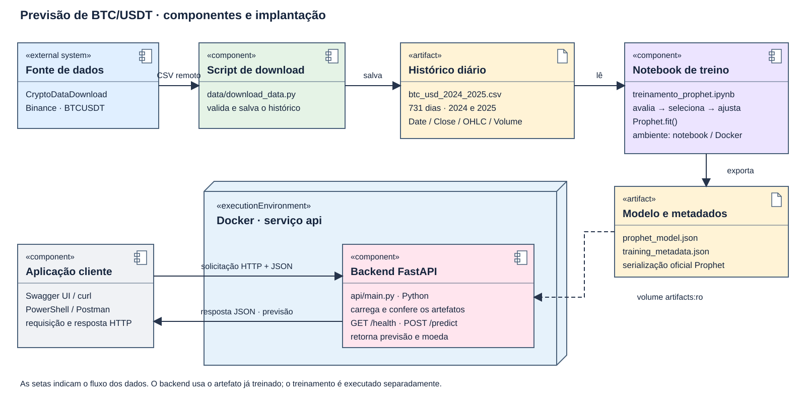
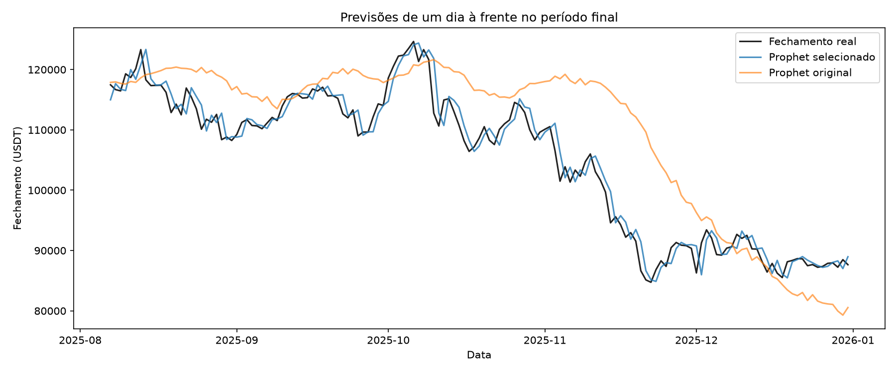
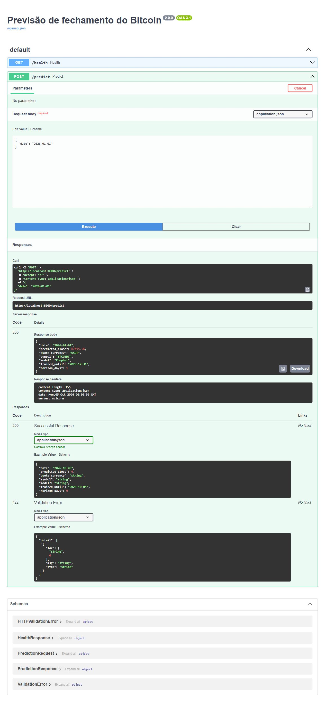
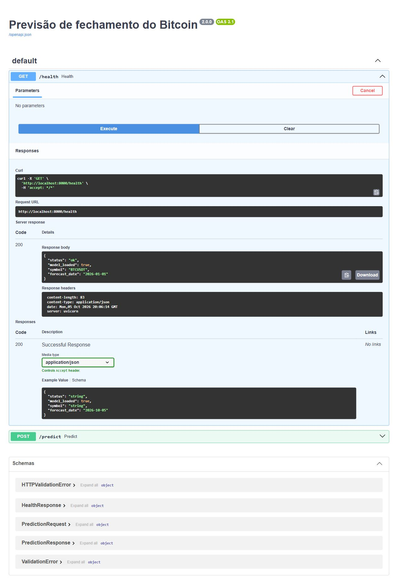

# Atividade Ponderada M7: previsão de BTC/USDT com Prophet

&emsp;A proposta deste projeto é acompanhar uma previsão desde o histórico de preços até a resposta de uma API. O treinamento acontece em um notebook, o modelo é salvo em JSON e um backend Python carrega esse arquivo dentro de um container Docker. Escolhi trabalhar com o fechamento diário do Bitcoin e com um horizonte de um dia. O foco é entender e demonstrar essa integração, como pede nas instruções

&emsp;A versão atual continua usando Prophet. Depois da revisão, o erro médio absoluto caiu de 6.878,25 para 1.604,10 USDT no mesmo período de comparação. Esse resultado melhorou bastante a primeira configuração, mas ainda ficou um pouco acima da referência de repetir o fechamento anterior. O processo de chegar até ele está registrado no devlog, incluindo as tentativas que não deram certo.

## Diagrama UML



&emsp;O diagrama mostra os componentes e onde o backend é executado. O script baixa o CSV, o notebook treina o Prophet e exporta o modelo junto com seus metadados. O Docker monta a pasta `artifacts` em `/app/artifacts` com acesso somente de leitura. Assim, o arquivo chega ao container de inferência sem ser enviado por uma API e sem precisar refazer o treinamento quando o backend inicia.

&emsp;A aplicação cliente pode ser o Swagger UI, o curl, o PowerShell ou o Postman. A solicitação HTTP parte do cliente para o backend, e a resposta JSON faz o caminho inverso. A imagem foi revisada para usar os nomes reais dos arquivos, indicar BTCUSDT e corrigir o sentido dessas setas. O desenho em SVG é uma imagem editável e está em `assets/`.

## Dados e escolha do modelo

&emsp;A base contém 731 registros diários, de 01/01/2024 a 31/12/2025. O ano de 2024 é bissexto, por isso dois anos completos resultam em 731 dias. Os dados são reais: vieram do histórico da Binance distribuído pelo CryptoDataDownload, uma das fontes sugeridas pelo professor. A origem está em data_source.json, e a base usada está em btc_usd_2024_2025.csv.

&emsp;No começo, a coleta tentou usar Yahoo Finance para BTCUSD, mas encontrou um limite de requisições. A alternativa foi BTCUSDT no CryptoDataDownload. Na revisão, defini essa segunda fonte como padrão para que uma nova execução não troque o par automaticamente. O nome antigo do CSV foi mantido para não quebrar os caminhos; a identificação correta é BTCUSDT, com preços em USDT. USDT e USD não são a mesma moeda.

&emsp;O downloader confere se todos os dias do período estão presentes e se os preços são positivos e finitos. O notebook também verifica a sequência completa, recusando lacunas e duplicatas. A base contém abertura, máxima, mínima, fechamento e volume. A versão exportada utiliza a data e o fechamento; os testes com volume ficaram como experimentos.

&emsp;A escolha do Prophet veio da sugestão do professor e da facilidade de observar as etapas de ajuste e previsão. A biblioteca recebe datas em `ds` e o alvo em `y`. Usei como referência o [guia inicial oficial](https://facebook.github.io/prophet/docs/quick_start.html). O backend permanece direto: carrega o JSON uma vez, valida a data recebida, chama `predict` e devolve o resultado.

&emsp;Na primeira versão, o alvo era o próprio preço. Na versão melhorada, o Prophet estima o retorno logarítmico diário, calculado como `log(fechamento_atual / fechamento_anterior)`. Depois da previsão, a conversão de volta é `ultimo_fechamento * exp(retorno_previsto)`. Isso permite modelar a variação diária sem exigir que a tendência do Prophet acompanhe diretamente todo o nível de preços. Continuo usando o mesmo modelo, com tendência constante e sazonalidade semanal.

## Como a avaliação funciona

&emsp;A revisão comparou 19 configurações do Prophet. Foram testadas a configuração original, janelas de 7, 14, 30, 60, 90 e 180 dias com duas flexibilidades de tendência, e versões de retorno diário com diferentes janelas e sazonalidade semanal opcional. Não removi dias difíceis da série para melhorar a métrica.

| Etapa | Datas | O que foi feito |
| --- | --- | --- |
| Validação 1 | 31/12/2024 a 29/01/2025 | 30 previsões de um dia |
| Validação 2 | 31/03/2025 a 29/04/2025 | 30 previsões de um dia |
| Validação 3 | 08/07/2025 a 06/08/2025 | 30 previsões de um dia |
| Comparação final | 07/08/2025 a 31/12/2025 | 147 previsões nas mesmas datas para as três referências |

&emsp;Em cada previsão, o ajuste usa somente os dias anteriores. Só depois de prever um dia o seu fechamento real entra no histórico da próxima rodada. Essa avaliação é chamada de walk-forward. A configuração é escolhida pelo MAE médio das 90 previsões de validação. As funções estão em [trainer/evaluation.py](trainer/evaluation.py), e a sequência de execução, tabelas e gráfico estão no [notebook](notebook/treinamento_prophet.ipynb).

&emsp;O melhor resultado na validação foi `retorno_todo_semanalTrue`, com MAE de 1.461,23 USDT. Essa configuração usa todos os retornos anteriores, crescimento constante, sazonalidade semanal e nenhuma sazonalidade diária ou anual. O ajuste usa L-BFGS, semente 42 e limite de 2.000 iterações. A previsão pontual não precisa de simulação de intervalos, então `uncertainty_samples=0`.

&emsp;Há uma limitação importante: os 147 dias finais já tinham sido consultados nas tentativas anteriores. A escolha desta rodada foi feita somente pela validação, mas o período final não pode ser apresentado como um teste totalmente inédito. Ele é uma comparação retrospectiva. Para confirmar a generalização, seria necessário fixar a configuração e avaliar dados novos ainda não utilizados nas decisões.

## Resultados atuais

| Configuração | MAE em USDT | MAPE | RMSE em USDT |
| --- | ---: | ---: | ---: |
| Prophet original, reexecutado nesta revisão | 6.878,25 | 6,87% | 8.930,14 |
| Prophet selecionado e exportado | 1.604,10 | 1,54% | 2.127,62 |
| Referência do fechamento anterior | 1.593,63 | 1,52% | 2.112,43 |

&emsp;MAE é a média do erro absoluto no preço. MAPE expressa esse erro em porcentagem. RMSE dá mais peso aos erros maiores. Nenhuma dessas medidas deve ser lida como porcentagem de acerto. A redução de MAE em relação à configuração original foi de aproximadamente 76,7%. Em relação ao fechamento anterior, o Prophet ainda teve MAE cerca de 0,66% maior. Por isso, o resultado permite dizer que a configuração melhorou, mas não que passou a prever o mercado melhor que uma referência simples.



&emsp;A linha do modelo melhorado acompanha o preço mais de perto porque cada previsão usa o fechamento real do dia anterior. Isso não significa que o modelo tenha antecipado toda a curva de agosto a dezembro de uma só vez. São 147 previsões separadas de um dia. Essa diferença também orientou a restrição da API ao próximo dia do histórico.

&emsp;Os resultados podem ser conferidos em [validation_results.csv](artifacts/validation_results.csv), [test_predictions.csv](artifacts/test_predictions.csv) e [training_metadata.json](artifacts/training_metadata.json). O último arquivo registra parâmetros, fonte, versões, datas, último fechamento e hashes do CSV e do modelo. O modelo final usa 730 retornos, derivados dos 731 fechamentos.

## Executar com Docker

&emsp;Os comandos abaixo devem ser executados na raiz do repositório, com o Docker Desktop aberto e usando containers Linux. Para iniciar a API com os artefatos já incluídos no projeto, o mesmo comando funciona no CMD e no PowerShell:

```text
docker compose up --build -d --wait api
docker compose ps
```

&emsp;O estado esperado é `healthy`. A API fica em [localhost:8000/docs](http://localhost:8000/docs). A porta foi publicada somente em `127.0.0.1`, suficiente para a demonstração local. O container usa um usuário sem privilégios de administrador, sistema de arquivos somente leitura e uma pasta temporária gravável. O healthcheck consulta `/health` a cada 30 segundos.

&emsp;O Compose tem dois perfis opcionais. Eles representam tarefas que terminam depois da execução, não serviços que precisam ficar ativos junto da API:

```text
docker compose --profile training run --rm --build train
docker compose restart api
```

&emsp;Esse comando executa todas as células do notebook e atualiza o próprio notebook, o modelo, os metadados, os resultados, o gráfico e o log do treinamento. O reinício faz a API carregar a nova versão. O notebook lê `data/` e `trainer/` em modo somente leitura; grava em `notebook/`, `artifacts/` e `assets/`. A execução completa desta revisão levou aproximadamente dois minutos e meio após as imagens estarem disponíveis. O tempo pode variar.

&emsp;Para repetir a coleta:

```text
docker compose --profile data run --rm --build download
```

&emsp;Esse comando substitui o CSV e os metadados da fonte em `data/`. Ele depende de internet e da disponibilidade do CryptoDataDownload. O CSV já versionado permite treinar e demonstrar sem fazer uma nova coleta. Para conferir somente o download, preservando os dados locais, use a saída temporária:

```text
docker compose --profile data run --rm -e DATA_DIR=/tmp/download-check download
```

&emsp;O script também aceita `--source yahoo` ou `--source auto`, executado como `python /app/download_data.py --source yahoo` dentro da imagem de download. Isso pode mudar o par para BTCUSD; nesse caso é necessário retreinar e conferir a moeda informada pelos metadados. O recorte de datas está fixado em 2024 e 2025 para reproduzir esta atividade. Uma operação diária exigiria atualizar o período no downloader e na validação do treinamento.

&emsp;Se preferir treinar localmente, instale `requirements-notebook.txt` e abra `notebook/treinamento_prophet.ipynb` no Jupyter. O caminho reproduzido nesta revisão foi o Docker. Para parar a aplicação:

```text
docker compose down
```

&emsp;Parar os containers não apaga o modelo, os dados nem os logs salvos nas pastas do projeto.

## Backend e demonstração

&emsp;O backend está em [api/main.py](api/main.py). Na inicialização, ele confere o hash do modelo, carrega o Prophet pela serialização oficial e lê os metadados. Se algum arquivo estiver ausente ou incompatível, o serviço não inicia com um modelo incorreto. O carregamento usa o ciclo de vida `lifespan` do FastAPI.

&emsp;`GET /health` retorna o estado do modelo e a data que pode ser prevista. `POST /predict` recebe uma data e retorna o fechamento, a moeda e o horizonte. Para os artefatos atuais, somente 01/01/2026 é permitido, pois o histórico termina em 31/12/2025. Datas anteriores, datas mais distantes, datas inexistentes, campos extras ou ausência da data retornam HTTP 422. Não há atualização automática de dados dentro da API.

&emsp;No PowerShell:

```powershell
Invoke-RestMethod http://localhost:8000/health
Invoke-RestMethod http://localhost:8000/predict -Method Post -ContentType "application/json" -Body '{"date":"2026-01-01"}'
```

&emsp;No CMD:

```bat
curl.exe http://localhost:8000/health
curl.exe -X POST http://localhost:8000/predict -H "Content-Type: application/json" -d "{\"date\":\"2026-01-01\"}"
```

&emsp;Resposta de saúde observada nesta revisão:

```json
{
  "status": "ok",
  "model_loaded": true,
  "symbol": "BTCUSDT",
  "forecast_date": "2026-01-01"
}
```

&emsp;Resposta de previsão observada depois de carregar o modelo melhorado:

```json
{
  "date": "2026-01-01",
  "predicted_close": 87495.56,
  "quote_currency": "USDT",
  "symbol": "BTCUSDT",
  "model": "Prophet",
  "trained_until": "2025-12-31",
  "horizon_days": 1
}
```

&emsp;O contrato foi corrigido: `predicted_close_usd` passou a ser `predicted_close`, acompanhado de `quote_currency`. Quem consumir a versão antiga precisa ajustar esse campo. A resposta antiga de 80.521,30 pertence ao modelo anterior e não é o resultado atual.

## Testes e evidências

&emsp;Estas capturas foram feitas no Swagger depois de executar as chamadas contra o container atual. Elas mostram a resposta real do servidor, além do exemplo de preenchimento da documentação.





&emsp;A revisão executou três testes de artefatos, dois de inicialização e oito verificações HTTP. Foram conferidos os dias do CSV, a separação entre validação e teste, a rejeição de uma base incompleta, os hashes, a previsão após recarregar o JSON, a ausência de modelo, os metadados incompatíveis, a saúde da API, a previsão e as entradas inválidas.

&emsp;Para repetir os testes no PowerShell:

```powershell
$repo = (Get-Location).Path
docker compose --profile training run --rm -v "${repo}\tests:/workspace/tests:ro" train python /workspace/tests/test_artifacts.py
docker compose run --rm --no-deps -v "${repo}\tests:/tests:ro" api python -m unittest discover -s /tests -p test_startup.py -v
docker compose run --rm --no-deps -v "${repo}\tests:/tests:ro" api python /tests/test_integration.py http://api:8000
```

&emsp;O teste HTTP exige que a API esteja ativa. Dentro da rede do Compose, o nome `api` identifica o serviço. O notebook e o downloader não ficam rodando após concluir suas tarefas.

| Registro | O que comprova |
| --- | --- |
| [training.log](artifacts/training.log) | Fonte, hash, versões, validação das 19 configurações, seleção, teste e exportação |
| [notebook-execution.log](logs/notebook-execution.log) | Execução completa do notebook pelo Compose |
| [download-check.log](logs/download-check.log) | Coleta real de 731 dias em um diretório temporário |
| [artifact-tests.log](logs/artifact-tests.log) | Integridade e leitura dos dados e artefatos |
| [startup-tests.log](logs/startup-tests.log) | Falhas esperadas quando faltam arquivos ou os metadados não correspondem |
| [integration-tests.log](logs/integration-tests.log) | Respostas HTTP 200 e rejeições HTTP 422 |
| [api-startup.log](logs/api-startup.log) | Construção e inicialização com estado saudável |
| [container-check.log](logs/container-check.log) | Usuário sem privilégios e ausência de permissão de escrita nos artefatos |
| [api.log](logs/api.log) | Carregamento do modelo e chamadas reais, com status e duração |
| [training-initial-optimizer.log](logs/training-initial-optimizer.log) | Tentativa interrompida por lentidão nas janelas pequenas |
| [schema-error-before-fix.log](logs/schema-error-before-fix.log) | Erro de tipo encontrado ao melhorar o Swagger, antes da correção |

&emsp;Os logs são saídas das execuções, não transcrições inventadas. O arquivo de treinamento é atualizado em cada nova execução. Os registros desta revisão usam a data de 05/10/2026, enquanto os dados usados no modelo são de 2024 e 2025. Alguns horários estão em UTC, três horas à frente do horário de São Paulo. O aviso de ausência do Plotly se refere somente a gráficos interativos opcionais; não impediu o ajuste nem as previsões.

&emsp;Para acompanhar uma demonstração ao vivo:

```text
docker compose logs -f api
```

## Devlog

&emsp;Organizei este relato pela sequência do desenvolvimento. As primeiras etapas resumem as decisões e execuções já registradas no projeto. A revisão final acrescenta arquivos de log com horários e resultados reais. Não atribuí horários às etapas antigas quando esse registro não existia.

### 1. Entendimento da atividade e definição do escopo

&emsp;A primeira decisão foi limitar o problema ao fechamento do dia seguinte. O enunciado dá mais peso à solução funcionando e ao devlog do que à precisão financeira. Por isso, a estrutura escolhida foi um notebook para treinar, um JSON para transportar o modelo e um backend Python para responder à aplicação cliente. O cliente pode ser uma ferramenta HTTP, sem a necessidade de criar uma interface própria.

&emsp;O professor recomendou dar destaque ao diagrama, explicar a escolha do modelo e depois mostrar a execução com Docker. A documentação passou a seguir essa ordem. O Prophet foi mantido porque era a sugestão do professor e porque a intenção era melhorar essa abordagem, não trocar de biblioteca a cada resultado.

### 2. Dados reais e mudança de fonte

&emsp;O período foi definido em dois anos completos. A tentativa inicial com Yahoo Finance encontrou limite de requisições, e a coleta passou para o arquivo da Binance no CryptoDataDownload. Isso resolveu a obtenção do histórico, mas trouxe uma diferença que precisava ser documentada: o par era BTCUSDT, não BTCUSD.

&emsp;O downloader inicialmente tinha um caminho de saída próprio de container. Esse caminho foi corrigido para aceitar DATA_DIR, e foi criada uma imagem específica para a coleta. Na revisão geral, a fonte da entrega virou o padrão do script, para evitar que uma nova execução alterasse o par silenciosamente. Também passei a exigir a sequência completa de 731 dias, em vez de aceitar apenas uma quantidade aproximada de registros.

&emsp;O teste desta revisão executou um download real para /tmp/download-check, dentro de um container temporário. A coleta retornou o período completo, e o CSV usado no treinamento foi preservado. A saída está em logs/download-check.log.

### 3. Primeiro treinamento e referência de comparação

&emsp;O treinamento foi organizado em notebook para deixar os dados, as etapas e as saídas visíveis. A primeira configuração previa o preço diretamente, com sazonalidade semanal e anual. Os registros foram separados em ordem cronológica, e a avaliação avançava um dia por vez.

&emsp;Durante a instalação inicial, o Prophet 1.1.6 apresentou um problema na configuração do CmdStan. A dependência foi atualizada para Prophet 1.2.2 e o treinamento passou a executar. O artefato foi salvo em JSON usando a função oficial de serialização da biblioteca.

&emsp;O primeiro resultado registrado foi MAE de 6.873,25 e MAPE de 6,86%. A referência do dia anterior teve MAE de 1.593,63 e MAPE de 1,52%. Isso mostrou que fazer a integração funcionar não era suficiente para considerar a previsão boa. A referência simples ficou no projeto justamente para tornar essa comparação visível.

### 4. Primeiras tentativas de melhoria

&emsp;Os primeiros experimentos alteraram a sazonalidade anual, a flexibilidade da tendência e o uso de sazonalidade multiplicativa. A versão multiplicativa melhorou a validação, mas teve MAE de 6.923,78 no período final e não substituiu o modelo naquele momento.

&emsp;Depois foram testados logaritmo do preço, retorno logarítmico e variáveis defasadas. A versão de retorno diário chegou a MAE de 1.597,75 no período final. O Prophet com o fechamento anterior como regressor obteve 1.600,98. Ambos se aproximaram da referência, mas não a superaram naquela comparação. As versões com mais variáveis, incluindo volume, não foram melhores na validação.

&emsp;Essas tentativas estão nos scripts de experiments/. Eles representam rodadas anteriores, com divisão de 70% para histórico inicial, 10% para validação e 20% para comparação final. O notebook atual usa outro desenho de validação, explicado acima. Esses scripts não são chamados pelo backend e não exportam o modelo atual.

&emsp;Também houve erros no script de regressores: uma transformação precisava do fechamento anterior, e a correção inicial acabou repetindo essa coluna quando ela já era um regressor. A seleção das colunas foi corrigida antes de repetir a execução. Um resultado parcial de um script com erro não foi tratado como experimento concluído.

### 5. Revisão da avaliação e seleção atual

&emsp;Na revisão geral, o objetivo foi comparar o Prophet em mais de um momento do histórico. Em vez de escolher pela mesma faixa curta de validação, foram usados três blocos de 30 dias, todos anteriores ao período final. A grade de 19 configurações ficou explícita em trainer/evaluation.py, e o notebook passou a salvar as métricas por bloco.

&emsp;As janelas pequenas trouxeram uma dificuldade de tempo de execução. O Prophet escolhia outro otimizador por padrão para menos de 100 observações. A primeira rodada foi interrompida, seu log foi preservado e o ajuste passou a usar L-BFGS de forma explícita. A execução completa seguinte terminou em cerca de dois minutos e meio. A semente, o limite de iterações e a ausência de simulação de intervalos também ficaram explícitos.

&emsp;O menor MAE na validação foi o do Prophet com retorno logarítmico, tendência constante e sazonalidade semanal usando todo o histórico anterior. A configuração foi então comparada com a original e com o fechamento anterior nos mesmos 147 dias. Ela reduziu o MAE do Prophet em aproximadamente 76,7%, mas permaneceu cerca de 0,66% acima da referência.

&emsp;A versão melhorada foi exportada porque reduziu bastante o erro da configuração original, mantendo o Prophet e uma inferência simples. O fato de não superar a referência continuou documentado. O resultado original foi reexecutado nesta rodada e ficou em 6.878,25, ligeiramente diferente dos 6.873,25 antigos. A tabela atual usa os números da mesma execução, com as opções de ajuste e semente agora explícitas.

### 6. Artefatos e coerência da inferência

&emsp;O modelo melhorado estima retorno, então salvar somente o JSON do Prophet não era suficiente para interpretar a saída. Os metadados passaram a incluir o alvo, o último fechamento e a próxima data. O notebook exportou 730 retornos obtidos dos 731 fechamentos e registrou a previsão de 87.495,56 USDT para 01/01/2026.

&emsp;Também foram incluídos os hashes do CSV e do modelo. A API verifica o hash do modelo na inicialização, o que ajuda a perceber quando o JSON e os metadados pertencem a execuções diferentes. Um teste recarrega o arquivo exportado e confere se a previsão é igual à registrada pelo notebook.

&emsp;O arquivo .gitattributes mantém as quebras de linha dos dados em LF no Git. Isso evita que uma mudança automática entre Windows e Linux altere o hash do mesmo CSV durante a reprodução.

&emsp;A API antiga aceitava qualquer data. Isso não correspondia ao teste de um dia à frente, especialmente ao converter um retorno usando o último fechamento conhecido. A revisão restringiu a operação ao próximo dia do histórico. Essa restrição deixa explícito o que o artefato consegue demonstrar.

### 7. Backend e contrato HTTP

&emsp;O backend continuou em um único arquivo Python. O carregamento passou a usar lifespan, e as entradas e saídas ficaram descritas no Swagger. A resposta agora separa o preço previsto da moeda, evitando chamar USDT de USD.

&emsp;Ao adicionar um exemplo para o campo date, apareceu um erro do Pydantic: o nome do campo entrava em conflito com o tipo importado com o mesmo nome. O erro foi salvo em logs/schema-error-before-fix.log. A correção foi importar o tipo como Date; depois disso, a imagem foi reconstruída e a verificação de saúde voltou a passar.

&emsp;O teste HTTP enviou uma solicitação válida e cinco solicitações inválidas. A válida retornou HTTP 200 com a previsão, e as inválidas retornaram HTTP 422. A documentação OpenAPI e a rota de saúde também foram verificadas. O serviço passou a registrar método, rota, status e duração das chamadas, além da identificação do modelo carregado.

### 8. Revisão dos containers

&emsp;O Compose passou a organizar a API como serviço padrão e a coleta e o treinamento como perfis opcionais. Isso deixou os comandos menores e iguais no CMD e no PowerShell. Os containers de coleta e treinamento terminam quando concluem a tarefa; a API continua ativa para receber solicitações.

&emsp;O modelo chega à API por um volume somente leitura. O backend roda com usuário sem privilégios de administrador, porta publicada apenas localmente e sistema de arquivos somente leitura. Durante o teste, o Matplotlib tentou criar um cache em uma pasta sem permissão. O caminho de cache foi direcionado para /tmp, que é gravável.

&emsp;As imagens foram construídas, a coleta foi testada, o notebook foi executado pelo Compose e a API chegou ao estado healthy. Foram mantidos os arquivos de construção e execução para que essa conclusão possa ser conferida nos logs.

### 9. Revisão da documentação e do diagrama

&emsp;A introdução e o diagrama continuam no começo. O desenho foi corrigido para representar a versão atual, incluindo o JSON de metadados e o sentido correto da comunicação HTTP. As imagens ficam em assets/; não foi criada uma pasta docs/.

&emsp;O README passou a distinguir a resposta antiga da resposta atual e os resultados históricos dos resultados desta revisão. Também foram incluídos comandos para CMD e PowerShell, testes de falha, o gráfico comparativo e links para os arquivos de evidência. O objetivo é permitir que outra pessoa acompanhe as decisões e reproduza a execução, sem depender apenas das capturas de tela.

### 10. Uso de IA e limites do trabalho

&emsp;Usei IA como apoio para organizar o escopo, revisar e implementar código, investigar erros, executar comparações e redigir a documentação. Os preços não foram inventados por IA. Vieram de uma fonte real, e a base utilizada pode ser identificada pelo hash. As conclusões sobre desempenho se apoiam nas execuções registradas, não em uma promessa de que o modelo seria preciso.

&emsp;Esta revisão foi feita depois das primeiras versões e não deve ser apresentada como se todas as melhorias tivessem sido feitas dentro dos 100 minutos sugeridos no enunciado. A apresentação ainda precisa mostrar compreensão das escolhas, principalmente da diferença entre preço e retorno, da montagem do artefato e da avaliação de um dia.

## Conferência com o enunciado

| Pedido da atividade | Onde está atendido |
| --- | --- |
| Esboço UML com treinamento, artefato, inferência e cliente | Diagrama no início, com volume somente leitura |
| Treinar em notebook ou container | Notebook executado pelo serviço temporário `train` |
| Exportar um modelo que possa ser carregado | JSON Prophet, metadados e teste de recarregamento |
| Backend obrigatoriamente Python | FastAPI em `api/main.py` |
| Operação de previsão e verificação de serviço | `POST /predict` e `GET /health` |
| Integrar e demonstrar solicitação e resposta | Teste HTTP, JSON real e logs |
| Devlog com decisões, dificuldades e comandos | Relato acima e arquivos de `logs/` |
| Entrega no GitHub | A revisão deve estar publicada antes da entrega |

&emsp;O projeto demonstra o fluxo exigido. As limitações restantes são a base histórica fixa, a ausência de atualização e retreinamento automáticos, a previsão restrita ao próximo dia e o fato de a referência simples ainda ter erro menor. A avaliação final também já foi consultada em rodadas anteriores. São limitações do experimento, não falhas escondidas da integração.

&emsp;Para a apresentação, começo pelo diagrama, mostro os artefatos, inicio a API, consulto a saúde e envio uma previsão. Depois abro os logs e explico um erro corrigido e a comparação do Prophet com a referência. O funcionamento e o devlog representam 80% da avaliação prevista; os outros 20% dependem das observações do professor. As previsões são experimentais e não são recomendação de investimento.

## Referências utilizadas

&emsp;O escopo segue o [arquivo de instruções](instruções-atividade.md). A implementação foi conferida com o [quick start](https://facebook.github.io/prophet/docs/quick_start.html), a documentação de [avaliação temporal](https://facebook.github.io/prophet/docs/diagnostics.html) e de [serialização e tendência constante do Prophet](https://facebook.github.io/prophet/docs/additional_topics.html). O ciclo de carregamento da API segue a documentação de [lifespan do FastAPI](https://fastapi.tiangolo.com/advanced/events/). A fonte do histórico é o [CryptoDataDownload](https://www.cryptodatadownload.com/).
